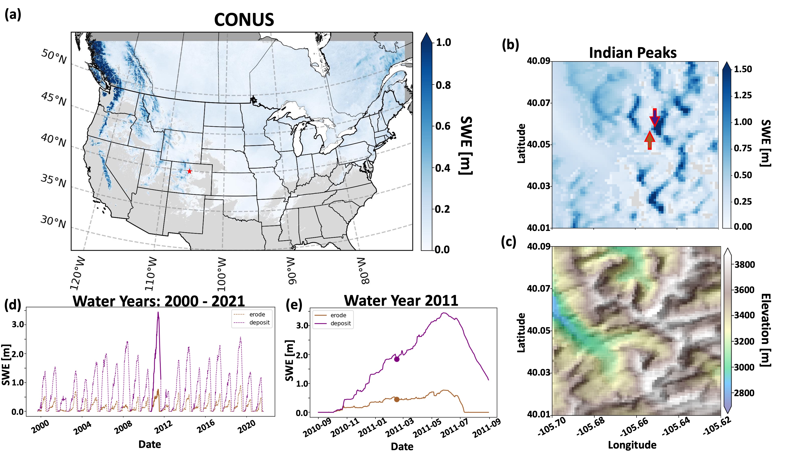

--- 
# **PARALLEL SNOWMODEL**  
---   

---      
## **OVERVIEW**  
---  
This repository contains developments to SnowModel, a distributed snow-evolution modeling system (Liston and Elder, 2006a; also see the Appendices in Liston et al. (2020)), as detailed in Mower et al. (2023). Model developments were focused on parallelizing the serial version of the code using Coarray Fortran syntax. This repository provides the Parallel SnowModel code and the analysis contained in Mower et al. (2023).  
   
***NOTE: This repository is intended to supplement the original version of SnowModel. For example, it does not contain the preprocessing steps necessary to run simulations. Please reach out to Glen Liston for more information about the original version of SnowModel.***     
               
### **REQUIRED COMPUTING INFRASTRUCTURE**    
  * **CPUs**          
  Parallel SnowModel can be executed in "serial" with one process (e.g. a laptop computer) but is designed to be executed in "parallel" with many processes. The available computing resources and problem size will help determine the appropriate setup. See Sect. 4 and Sect. 5 from Mower et al. (2023) for examples.      
    * **Access**      
    Many Universities and most Federal Grants have the ability to request super computing hours through various research institutions such as:    
      - NASA     
      - XSEDE    
      - NCAR           
     
---      
## **GETTING STARTED** 
---       
This is a general workflow for the user to run Parallel SnowModel simulations.    
### **RUNNING PARALLEL SNOWMODEL** 
1. **Install the necessary modules**       
    - Navigate to `./env` directory   
    - Follow instructions in `./env/README.md` to download and test that the necessary modules work.        
2. **Compile Parallel SnowModel**        
    - Navigate to `./code` directory  
    - Follow instructions in `./code/README.md` to compile the code.   
    - Confirm that executable is located in base directory  
      - e.g. `./sm_parallel_nonetcdf` 
3. **Run Parallel SnowModel** 
    - Use the preprocessing steps from original SnowModel code base to create domain.
    - Update `snowmodel.par` to reflect the intended simulations.
    - Run simulation using parallel executable from above.
      
### **PARALLEL SNOWMODEL ANALYSIS**    
The following directories in `./analysis/` have output files and figures from the experiments used in Mower et al. (2023). The gridded output variables from these simulations could not be saved due to their file sizes. However, the output files generated from the SnowModel simulations can be used to recreate the analysis.
  - `./analysis/conus`
    - provides output files and figures relating to Parallel SnowModel simulations over the contiguous United States (CONUS) from 2000 - 2021.   
  - `./analysis/improvement`  
    - Uses different git versions of Parallel SnowModel to demonstrate parallel performance improvement using code profiling and strong scaling techniques.  
  - `./analysis/peak_memusage`  
    - Identifies the memory requirements using peak_memusage package (https://github.com/NCAR/peak_memusage) based on scaling experiments performed on six domains in CONUS.    
  - `./analysis/scaling`  
    - Performs strong scaling analysis over six domains in CONUS using the current version of the code.   
  - `./analysis/validation`
    - Compares and validates output from serial and parallel simulations for two different domains.        
---  
## **Limitations**
---      
***Users are cautioned that the developments here are not yet included in the publicly-available SnowModel source code. Differences in model versions are possible. Users are encouraged to inquire about the most-recent model developments and whether the model here is best for their purposes.***  
  
The core components of SnowModel as seen through the primary submodules within EnBal, MicroMet, SnowPack, and SnowTran have been parallelized through this work. However, there are still functionalities of the serial version of the code that have not been parallelized or adequately tested. Some examples include lagrangian seaice modeling, data assimilation, etc. See Appendix A in Mower et al. (2023) for more details on modeling applications that have not been parallelized.      
  
---     
## **References**  
---     
- Liston, G. E., & Elder, K. (2006a). A distributed snow-evolution modeling system (SnowModel). Journal of Hydrometeorology, 7(6), 1259-1276. 
- Liston, G. E., & Elder, K. (2006b). A meteorological distribution system for high-resolution terrestrial modeling (MicroMet). Journal of Hydrometeorology, 7, 217-234.
- Liston, G. E., Itkin, P., Stroeve, J., Tschudi, M., Stewart, J. S., Pedersen, S. H., Reinking, A. K., and Elder, K. (2020). A Lagrangian snow‐evolution system for sea‐ice applications (SnowModel‐LG): Part I—Model description, Journal of Geophysical Research: Oceans, 125, e2019JC015913.  
- Mower, R., Gutmann, E. D., Lundquist, J., Liston, G. E., and Rasmussen, S. (2023). Parallel SnowModel (v1.0): a parallel implementation of a Distributed Snow-Evolution Modeling System (SnowModel), Journal of Geoscientific Model Development.   
---      
## **Maintainers**   
---    
Ross Mower  
rossamower@ucar.edu  

Ethan Gutmann  
gutmann@ucar.edu  

Glen Liston  
Glen.Liston@colostate.edu  
  
---  

