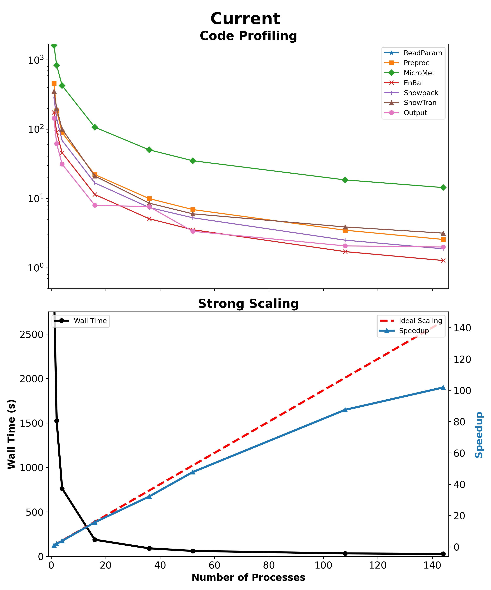

---  
# IMPROVEMENT ANALYSIS DOMAIN GENERATION  
---   
     
  
## **Description**  
The following directory contains the output files and figures for the improvement analysis (Sect 4.2) executed on the Colorado Headwaters domain as shown in Mower et al. (2023). It compares parallel performance metrics of strong scaling and code profiling of different versions of the code through its development. The following represents the three different versions of the Parallel SnowModel code.      
  * 96525a4 - initial commit  
      - github commit where timing variables were introduced.    
  * 8c02fc4 - parallel i/o  
      - github commit where parallel I/O procedures were introduced.    
  * df2c6c5 - cleaned parallel snowmodel   
      - recent github commit with cleaned code.  
  
  

