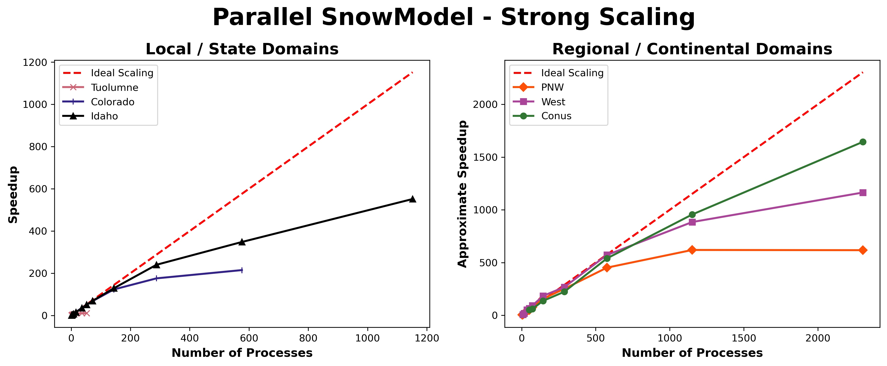

---  
# SCALING ANALYSIS DOMAIN GENERATION  
---     

---   
  
## **Description**  
The following directory contains the output files and figures generated by the scaling analysis (Sect 4.2) executed on six domains throughout CONUS as shown in Mower et al. (2023). It compares parallel performance metrics of speedup and approximate speedup profiling over the different domains. 

  

